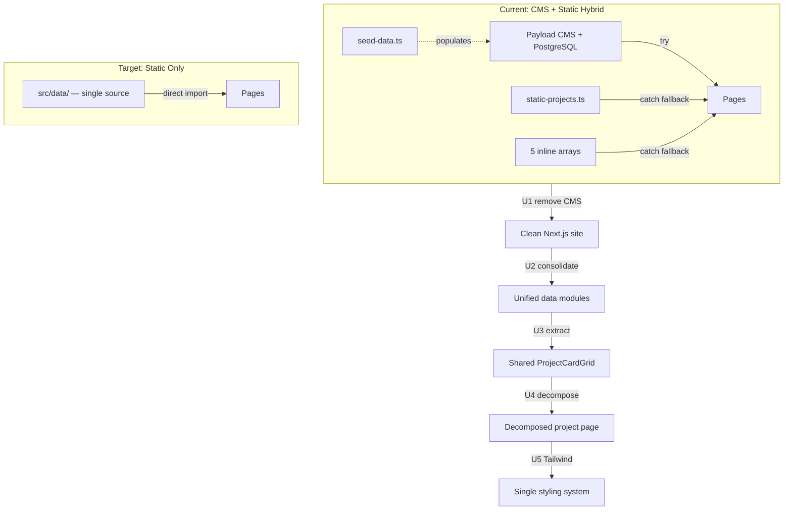
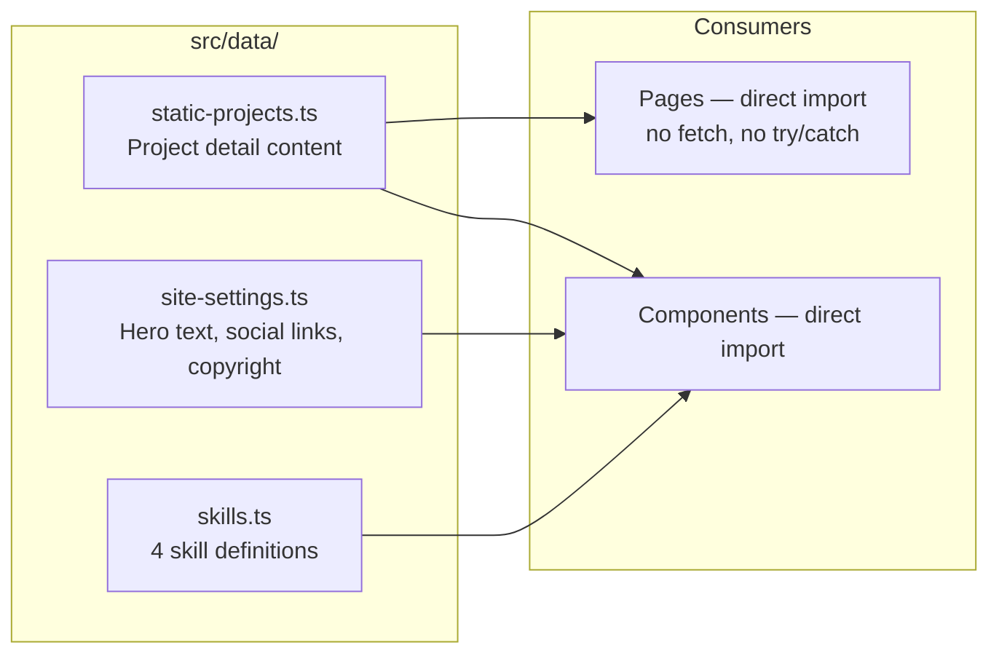
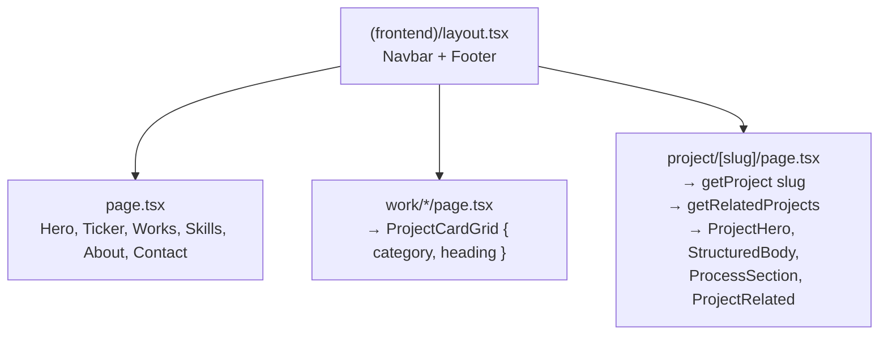

## Goal Capsule

- **Objective:** Reduce the pamgnn-react portfolio from a CMS-backed hybrid architecture to a clean static Next.js site by removing Payload CMS, unifying the triplicated data layer, extracting shared components, decomposing a complexity-42 page, and consolidating the split CSS architecture to Tailwind.
- **Authority:** Architecture decisions in this plan override existing patterns. Static data (`src/data/`) is the canonical source of truth.
- **Execution profile:** Five sequential phases. Each phase produces a working site — no mid-phase breakage is acceptable. Deploy and verify after every phase via `./scripts/control.sh rebuild-frontend`.
- **Stop conditions:** All `as never` casts removed. All Payload deps, collections, globals, and scripts deleted. All inline static fallback arrays consolidated. Four work category pages collapsed into one shared component. Project `[slug]` page complexity below 10. Seven standalone CSS files replaced by Tailwind utilities. Full test suite passes. Site renders identically at `http://76.13.4.115:55800`.

---

## Product Contract

### Summary

The pamgnn-react portfolio runs on Next.js 16 with Payload CMS 3 embedded on the same server, backed by PostgreSQL. Analysis found that Payload provides negligible value for a solo-designer portfolio of this scale (~9 projects, ~5 pages, content changes quarterly): every CMS query has a complete static fallback, the generated types are unused, and the `as never` pattern pervades every data access. Removing Payload eliminates PostgreSQL, seed scripts, migrations, and the CMS/static duality that caused data triplication.

The cleanup proceeds in five sequenced phases: CMS removal, data unification, shared component extraction, page decomposition, and CSS consolidation to Tailwind. Each phase produces a deployable site.

### Problem Frame

The codebase suffers from layered complexity accumulated during rapid iteration:

1. **Payload CMS adds infrastructure without proportional benefit.** PostgreSQL, migrations, seed scripts, and CMS queries exist alongside complete static fallbacks. The dual data path forces every page to try CMS first and fall back to static, producing `try/catch` chains and `as never` casts everywhere.
2. **Project data lives in three independent copies.** `static-projects.ts`, `seed-data.ts`, and inline arrays in 5 page/component files all define the same projects. Adding a project requires touching 5+ files.
3. **Four work category pages share ~90% identical code.** `work/branding`, `work/illustration`, `work/web-design`, and `work/reel` each independently import Payload, fetch by category, embed a static fallback array, and render the same project card grid.
4. **The project detail page has cyclomatic complexity 42.** It fetches from CMS, falls back to static, builds gallery arrays, constructs related projects, routes between three content renderers, and renders the layout — all in one 200-line component.
5. **Tailwind CSS is installed but unused.** Seven standalone CSS files plus scattered inline styles create a split styling surface.

### Requirements

**R1.** Payload CMS and all its dependencies (`payload`, `@payloadcms/*`, `@payloadcms/db-postgres`, `@payloadcms/richtext-lexical`, `@payloadcms/next`, `@payloadcms/ui`) are removed from the project.

**R2.** PostgreSQL service is removed from `docker-compose.yml`. The app runs as a single container.

**R3.** All Payload-specific directories are deleted: `src/collections/`, `src/globals/`, `src/app/(payload)/`, `src/payload.config.ts`, `src/payload-types.ts`, `src/lib/payload.ts`.

**R4.** All seed and migration scripts are deleted: `scripts/seed.ts`, `scripts/seed-data.ts`, `scripts/run-migrations.ts`, `scripts/run-payload-migrations.mjs`.

**R5.** Every data access that used `getPayloadClient()` is replaced with direct imports from `src/data/`.

**R6.** `src/data/static-projects.ts` is the single source of truth for all project content. Inline fallback arrays in work pages and sections are removed.

**R7.** A shared `ProjectCardGrid` component replaces the duplicated project rendering in all four work category pages. Each page passes only a category filter and heading.

**R8.** The project `[slug]/page.tsx` is decomposed into focused helpers: `getProject(slug)`, `getRelatedProjects(currentSlug)`, `buildGalleryImages(project)`. Cyclomatic complexity drops below 10.

**R9.** A `loading.tsx` skeleton and an `error.tsx` boundary are added to the project route.

**R10.** All styling is migrated to Tailwind utility classes. The seven standalone CSS files (`base.css`, `navbar.css`, `hero.css`, `layout.css`, `animations.css`, `project-page.css`, `responsive.css`) are removed. `globals.css` retains only CSS custom properties and Tailwind directives. Inline `style={{}}` props are extracted to utility classes where practical.

**R11.** The site renders identically to its current appearance at every phase boundary.

**R12.** All existing tests pass: `pnpm run test:int` and `pnpm run test:e2e`.

### Scope Boundaries

**Deferred to Follow-Up Work:**

- Footer data caching (static data is now imported directly — no DB query to cache)
- `package.json` name field fix
- Playwright visual regression tests
- Image optimization pipeline
- CI/CD pipeline changes

**Outside this product's identity:**

- New features or pages
- Visual redesign or UX changes
- Framework migration (stays on Next.js 16)
- Performance optimization beyond what naturally improves from removing CMS overhead
- SEO or accessibility audit

---

## Planning Contract

### Key Technical Decisions

**KTD-1. Remove Payload CMS entirely rather than flipping the CMS/static relationship.**
Removing Payload eliminates PostgreSQL, the `as never` pattern, seed scripts, and the dual data path in one operation. The alternative (keeping Payload with static-as-primary) would leave the Docker database dependency and CMS build overhead in place for a feature that provides negligible benefit at this scale.

**KTD-2. Tailwind utilities over standalone CSS files.**
Tailwind is already configured (`tailwind.config.ts`, PostCSS plugin, `@tailwindcss/postcss`). Committing to Tailwind means styles live in components, not in separate files — the Next.js colocation convention. The standalone CSS files are deleted and their rules expressed as utility classes. CSS custom properties in `globals.css` are kept for the design token layer (colors, radii, spacing).

**KTD-3. Static data as the sole source of truth.**
With Payload removed, there is no database. `src/data/` holds all content: project details, skills, site settings. Content changes are code changes — appropriate for a portfolio updated quarterly by a developer.

**KTD-4. Contact form stays as an API route with nodemailer.**
The existing `src/app/api/contact/route.ts` already uses `nodemailer` directly. No CMS dependency to remove here — it's already independent.

**KTD-5. Phase-gated deployment.**
Each phase ends with a deployable site. No phase is allowed to ship a broken build. This means removing Payload config from `next.config.ts` and `package.json` scripts in the same commit that removes Payload imports from components.

### High-Level Technical Design

**Data architecture after Payload removal:**

**Component tree after refactor:**

### Assumptions

- `nodemailer` and SMTP credentials in `.env` are sufficient for the contact form — no CMS mail config is needed.
- All media files are already served from `/public/images/` — the Payload Media collection was unused or duplicate.
- The `next.config.ts` `withPayload` wrapper is the only Payload integration in the Next.js config layer.
- The site owner is comfortable editing TypeScript for content changes (or can use the existing `scripts/control.sh` deploy workflow for any future content management tooling).
- Existing e2e tests (`tests/e2e/frontend.e2e.spec.ts`, `tests/e2e/frontend-ux.e2e.spec.ts`) cover enough page structure that visual regression is not blocking.

### Sequencing

Phases execute strictly in order. Each phase is a deployable checkpoint:

1. **U1 — Remove Payload CMS** (mechanical deletion + import replacement)
2. **U2 — Unify data layer** (consolidate static data, remove inline arrays)
3. **U3 — Extract ProjectCardGrid** (shared component, collapse work pages)
4. **U4 — Decompose project page** (helpers, loading/error boundaries)
5. **U5 — Migrate CSS to Tailwind** (replace 7 CSS files with utilities)

---

## Implementation Units

### U1. Remove Payload CMS

- **Goal:** Eliminate Payload CMS, PostgreSQL, and all associated infrastructure from the project.
- **Requirements:** R1, R2, R3, R4, R11, R12
- **Dependencies:** None
- **Files:**
  - Delete: `src/collections/Media.ts`, `src/collections/Projects.ts`, `src/collections/Skills.ts`, `src/collections/Users.ts`
  - Delete: `src/globals/SiteSettings.ts`
  - Delete: `src/payload.config.ts`, `src/payload-types.ts`, `src/lib/payload.ts`
  - Delete: `src/app/(payload)/**` (admin, api routes, layout, importMap)
  - Delete: `scripts/seed.ts`, `scripts/seed-data.ts`, `scripts/run-migrations.ts`, `scripts/run-payload-migrations.mjs`
  - Modify: `package.json` — remove `payload`, `@payloadcms/db-postgres`, `@payloadcms/richtext-lexical`, `@payloadcms/next`, `@payloadcms/ui`, `sharp`. Remove `generate:importmap`, `generate:types`, `payload` scripts.
  - Modify: `next.config.ts` — remove `withPayload` wrapper, remove `@payloadcms/next/withPayload` import. `nextConfig` becomes a plain default export.
  - Modify: `docker-compose.yml` — remove `postgres` service, remove `PAYLOAD_SECRET` and `DATABASE_URL` from app environment.
  - Modify: `Dockerfile` — simplify if Payload-specific build steps exist. Remove `sharp` from build dependencies.
  - Modify: `src/app/(frontend)/page.tsx` — remove `getPayloadClient` import and CMS fetch for hero text. Use static defaults or import from new `src/data/site-settings.ts` (to be created in U2).
  - Modify: `src/app/(frontend)/project/[slug]/page.tsx` — remove `getPayloadClient` import and all CMS queries. Temporarily use `STATIC_PROJECTS` directly (full refactor in U4).
  - Modify: `src/components/layout/Footer.tsx` — remove `getPayloadClient` import and `findGlobal` call. Use static defaults.
  - Modify: `src/components/sections/Works.tsx` — remove `getPayloadClient` import and CMS query. Use static data.
  - Modify: `src/components/sections/Hero.tsx` — if CMS props are removed from parent, rely on component defaults.
  - Modify: `src/app/(frontend)/work/branding/page.tsx` — remove `getPayloadClient`. Use inline static array (consolidated in U2).
  - Modify: `src/app/(frontend)/work/illustration/page.tsx` — same.
  - Modify: `src/app/(frontend)/work/web-design/page.tsx` — same.
  - Modify: `src/app/(frontend)/work/reel/page.tsx` — same.
  - Modify: `src/app/(frontend)/about/page.tsx` — if it uses CMS, switch to static.
  - Modify: `src/app/(frontend)/contact/page.tsx` — if it uses CMS, switch to static.
  - Modify: `.env`, `.env.docker`, `.env.example` — remove `PAYLOAD_SECRET` and `DATABASE_URL` if present.
  - Modify: `tailwind.config.ts` — remove any Payload-specific content paths if present.
  - Verify: All existing integration and e2e tests (`tests/int/`, `tests/e2e/`) still pass or are updated.

- **Approach:** Mechanical deletion then import-path repair. Start by deleting all Payload-owned directories, then modify each consumer file to remove `getPayloadClient` calls. Where a component needed CMS data, substitute the existing static fallback value. For the hero text that currently comes from `SiteSettings`, use the hardcoded defaults already present in the Hero component — the site settings module created in U2 will centralize these later. The contact form (`src/app/actions/contact.ts`, `src/app/api/contact/route.ts`) should be checked: if it imports Payload for email config, replace with direct env var reads.
- **Patterns to follow:** Delete-then-import pattern — never delete a file that another file still imports. Work file-by-file; verify the TypeScript build after each batch.
- **Test scenarios:**
  - Build succeeds with `next build` after all deletions.
  - Home page renders hero, ticker, works, skills, about, contact sections.
  - Each work category page renders its project grid.
  - Each project detail page renders hero, body, related projects.
  - Reel page renders video player.
  - Contact form submits and shows success message.
  - Footer renders social links and copyright.
  - `pnpm run test:int` passes.
  - `pnpm run test:e2e` passes.
- **Verification:** `next build` succeeds with zero errors. `./scripts/control.sh rebuild-frontend` deploys a working site. All pages render identically to the pre-Payload state.

### U2. Unify Data Layer

- **Goal:** Consolidate all project data, site settings, and skill definitions into `src/data/` as the single source of truth. Remove every inline static fallback array.
- **Requirements:** R5, R6
- **Dependencies:** U1
- **Files:**
  - Keep and expand: `src/data/static-projects.ts` — remains the canonical project content file. Remove any references to Payload types (`import('@/types/content-sections')` stays — those types are Payload-independent). Re-export a `PROJECT_SLUGS` array for iteration.
  - Create: `src/data/site-settings.ts` — one object exporting hero lines, social links, copyright, contact email, site name.
  - Create: `src/data/skills.ts` — one array exporting the 4 skill definitions with names, descriptions, and icon paths.
  - Modify: `src/components/sections/Hero.tsx` — import hero text from `site-settings.ts` (passed as props from `page.tsx` or read directly).
  - Modify: `src/app/(frontend)/page.tsx` — import hero lines from `site-settings.ts` instead of CMS.
  - Modify: `src/components/layout/Footer.tsx` — import social links and copyright from `site-settings.ts`.
  - Modify: `src/components/sections/Works.tsx` — remove inline `STATIC_FEATURED` array. Import from `static-projects.ts` (filter by `featured: true`).
  - Modify: `src/components/sections/Skills.tsx` — remove inline `defaultSkills` array. Import from `skills.ts`.
  - Modify: `src/app/(frontend)/work/branding/page.tsx` — remove inline `STATIC_BRANDING` array. Import from `static-projects.ts` (filter by category `identity`).
  - Modify: `src/app/(frontend)/work/illustration/page.tsx` — remove inline `STATIC_ILLUSTRATION` array. Import from `static-projects.ts` (filter by category `illustration`).
  - Modify: `src/app/(frontend)/work/web-design/page.tsx` — remove inline `STATIC_WEB_DESIGN` array. Import from `static-projects.ts` (filter by category `web-design`).
  - Modify: `src/app/(frontend)/work/reel/page.tsx` — remove inline `STATIC_MOTION_PROJECTS` array. Import from `static-projects.ts` (filter by category `motion`).
  - Modify: `src/app/(frontend)/project/[slug]/page.tsx` — remove inline fallback logic that builds `relatedProjects` from `STATIC_ALL_PROJECTS`. Import directly.
  - Modify: `src/lib/project-images.ts` — ensure `SLUG_IMAGES` stays and `getCoverImage` only handles static slugs.
  - Delete: `scripts/run-payload-migrations.mjs` (if not already deleted in U1).
- **Approach:** Each data module exports a single typed constant. Consumers import the constant directly — no functions, no fetch, no try/catch. `static-projects.ts` keeps its existing structure but adds a `PROJECT_SLUGS` array and a `getProjectBySlug(slug)` utility. The inline `STATIC_*` arrays in work pages are replaced with filtered views of the central project list. After this phase, `static-projects.ts` is the only file that defines project content — adding a project means adding one entry to one file.
- **Patterns to follow:** Single-export modules. `src/data/` is a data directory, not a collection of utility functions — each file exports one data constant.
- **Test scenarios:**
  - Home page Works section shows featured projects (currently 4).
  - Web Design page shows web-design-category projects.
  - Illustration page shows illustration-category projects.
  - Branding page shows identity-category projects.
  - Reel page shows motion-category projects.
  - Each project detail page renders its content from static data.
  - Footer shows correct social links from `site-settings.ts`.
  - Hero shows correct text from `site-settings.ts`.
  - Skills section shows 4 skills from `skills.ts`.
- **Verification:** No file outside `src/data/` contains an inline array of project data. No file imports `getPayloadClient`. `next build` succeeds. Manual page-by-page comparison confirms content matches current site.

### U3. Extract Shared ProjectCardGrid Component

- **Goal:** Replace the four nearly-identical work category pages with a single shared component parameterized by category and heading.
- **Requirements:** R7
- **Dependencies:** U2
- **Files:**
  - Create: `src/components/ui/ProjectCardGrid.tsx` — accepts `projects: ProjectCardData[]` and optional `heading?: string`. Renders the grid of project cards (image, overlay, link). Import `getCoverImage` from `src/lib/project-images.ts`.
  - Modify: `src/app/(frontend)/work/web-design/page.tsx` — replace body with `<ProjectCardGrid projects={filterByCategory('web-design')} heading="Web Design" />`. Add a filter utility or inline the filter.
  - Modify: `src/app/(frontend)/work/illustration/page.tsx` — same pattern, `heading="Illustration"`.
  - Modify: `src/app/(frontend)/work/branding/page.tsx` — same pattern, `heading="Identity & Branding"`.
  - Modify: `src/app/(frontend)/work/reel/page.tsx` — same pattern, `heading="Motion & Reel"`. Keep `ReelVideoPlayer` above the grid — only replace the grid section.
  - Consider: `src/components/sections/Works.tsx` — if the grid rendering is identical to `ProjectCardGrid`, use the shared component there too. If the homepage layout differs (staggered grid), keep it separate.
- **Approach:** `ProjectCardGrid` is a server component — no `'use client'` directive needed. It accepts an array of `{ slug, title, coverImage?, accentColor? }` objects and renders the same grid markup currently duplicated across 4 pages. Each work page becomes a thin wrapper: import `STATIC_PROJECTS` (or the filtered utility from U2), pass the filtered list to `ProjectCardGrid`. Category filtering can be a small utility in `static-projects.ts`: `getProjectsByCategory(category: string)`.
- **Patterns to follow:** Server component with data passed as props. The component is presentational — it receives data, it doesn't fetch it.
- **Test scenarios:**
  - Each work page renders its correct heading and project grid.
  - Project cards link to correct `/project/[slug]` URLs.
  - Hover overlay shows on each card.
  - Grid layout matches the current two-column staggered layout.
  - Empty state (no projects in category) renders heading with empty grid — no crash.
- **Verification:** All 4 work pages render identically to their pre-U3 state. `next build` succeeds. No duplicated project card rendering JSX exists outside `ProjectCardGrid`.

### U4. Decompose Project [slug] Page

- **Goal:** Reduce cyclomatic complexity from 42 to below 10 by extracting data access, gallery building, and related project logic into focused helpers. Add loading and error boundaries.
- **Requirements:** R8, R9
- **Dependencies:** U2
- **Files:**
  - Create: `src/lib/project-helpers.ts` — exports:
    - `getProject(slug: string): StaticProject | null` — looks up a project from `STATIC_PROJECTS`. Returns null if not found.
    - `getRelatedProjects(currentSlug: string, limit?: number): RelatedProject[]` — returns all projects except current, sorted, limited.
    - `buildGalleryImages(project: StaticProject): { src: string; alt: string }[]` — extracts gallery images from project data.
    - `getBackLink(categories?: string[]): string` — moved from `ProjectHero.tsx` or kept there if only used in that component.
  - Create: `src/app/(frontend)/project/[slug]/loading.tsx` — skeleton UI: a centered container with pulsing placeholders for hero title, summary line, and content blocks.
  - Create: `src/app/(frontend)/project/[slug]/error.tsx` — `'use client'` error boundary. Shows "Something went wrong" message with a "Return home" link. Uses the existing `display-3` and `button-with-icon` classes.
  - Modify: `src/app/(frontend)/project/[slug]/page.tsx` — refactor to:
    1. Call `getProject(slug)` — if null, `notFound()`.
    2. Call `getRelatedProjects(slug)`.
    3. Render `ProjectHero`, content section (`StructuredBody`, `StaticBody`, `ProjectBody` based on available data), `ProcessSection` if process exists, `ProjectRelated`.
    4. Remove the inline gallery-building loop, the inline related-projects mapping, and all `as` type casts.
  - Modify: `src/components/project/ProjectHero.tsx` — if `getBackLink` is moved to helpers, import from there. Otherwise unchanged.
- **Approach:** The helpers file is pure functions — no React, no hooks. This makes them trivially testable and reusable. The page component becomes declarative: get data, render components. The loading skeleton uses Tailwind `animate-pulse` (or a CSS animation from the existing animations file) on placeholder divs. The error boundary is a standard Next.js `error.tsx` that logs the error and shows a user-friendly message.
- **Patterns to follow:** Next.js file conventions — `loading.tsx` and `error.tsx` are siblings to `page.tsx` in the route directory. Keep the data access in `src/lib/` to maintain the existing convention of utility modules there.
- **Test scenarios:**
  - Valid slug renders project page with hero, content, and related projects.
  - Invalid slug renders the 404 page (from `notFound()` call).
  - Project with `sections` renders `StructuredBody`.
  - Project with only `contentHtml` renders `StaticBody`.
  - Project with `process` array renders `ProcessSection`.
  - Project with no related projects renders heading only (no grid).
  - Loading skeleton appears briefly on navigation (verify in dev mode with throttling).
  - Error boundary catches a thrown error and shows recovery UI.
  - `getProject` returns null for nonexistent slug.
  - `getRelatedProjects` excludes the current slug from results.
  - `buildGalleryImages` handles empty gallery array.
- **Verification:** `next build` succeeds. Project pages render identically to pre-U4 state. Manual test: visit each project slug, verify content, verify related projects carousel.

### U5. Migrate CSS to Tailwind

- **Goal:** Replace all standalone CSS files with Tailwind utility classes. Retain CSS custom properties in `globals.css` as the design token layer.
- **Requirements:** R10, R11
- **Dependencies:** U1, U2, U3, U4 (all previous phases — styling touches every component)
- **Files:**
  - Modify: `src/app/globals.css` — keep only: `@import 'tailwindcss'`, CSS custom properties (`:root { --secondary: …; --dark: …; … }`), and base reset styles (`*, *::before, *::after { box-sizing }`, `html { scroll-behavior }`, `body { margin; min-height; font-family; bg; color; antialiased }`, `a { color; text-decoration }`).
  - Delete: `src/styles/base.css` — migrate rules to `globals.css` or Tailwind utilities.
  - Delete: `src/styles/navbar.css` — migrate to `Navbar.tsx` utility classes.
  - Delete: `src/styles/hero.css` — migrate to `Hero.tsx` and project hero components.
  - Delete: `src/styles/layout.css` — migrate layout rules to layout components and page sections.
  - Delete: `src/styles/animations.css` — migrate keyframes to `tailwind.config.ts` `extend.keyframes` and `extend.animation`, or keep as a small `src/styles/animations.css` if Tailwind's animation config is too verbose for complex float keyframes.
  - Delete: `src/styles/project-page.css` — migrate to project components (`ProjectHero`, `SectionText`, `SectionFullWidthImage`, `SectionDetailsGrid`, `SectionSideBySide`, `ProjectRelated`, `ProcessSection`).
  - Delete: `src/styles/responsive.css` — responsive rules become Tailwind's `sm:`, `md:`, `lg:` prefixes.
  - Delete: `src/app/(frontend)/styles.css` — the barrel import file, no longer needed.
  - Modify: `tailwind.config.ts` — extend theme to include custom colors (`dark`, `dark2`, `secondary`, `ticker`, `backdrop`, `bhover`, `dark-70`, `white`), font families (`sans: ['Exo', 'var(--font-exo)', 'sans-serif']`, `serif`, `exo`), letter spacing (`wide: '0.03em'`), borderRadius (`card: '10px'`, `pill: '50px'`), spacing (`xs: '80px'`, `s: '110px'`, `m: '140px'`, `l: '200px'`).
  - Modify: All components that use inline `style={{}}` — extract to Tailwind classes where practical. Keep dynamic inline styles (e.g., `backgroundColor: project.accentColor`) since those depend on data.
  - Modify: `src/components/layout/Navbar.tsx` — replace CSS class references with Tailwind utilities.
  - Modify: `src/components/sections/Hero.tsx` — replace CSS class references.
  - Modify: `src/components/sections/Works.tsx` — replace CSS class references.
  - Modify: `src/components/sections/Skills.tsx` — replace CSS class references.
  - Modify: `src/components/sections/About.tsx` — replace CSS class references and inline styles.
  - Modify: `src/components/sections/ContactSection.tsx` — replace CSS class references and inline styles.
  - Modify: `src/components/sections/Ticker.tsx` — replace CSS class references.
  - Modify: `src/components/layout/Footer.tsx` — replace CSS class references.
  - Modify: `src/components/ui/*.tsx` — replace CSS class references.
  - Modify: `src/components/project/*.tsx` — replace CSS class references.
  - Modify: `src/app/(frontend)/not-found.tsx` — replace inline styles with Tailwind.
  - Modify: `src/app/(frontend)/about/page.tsx` — if it had inline styles, migrate.
  - Modify: `src/app/(frontend)/contact/page.tsx` — if it had inline styles, migrate.

- **Approach:** Work component-by-component, one CSS file at a time. For each CSS file being deleted: find every class name used, translate to the closest Tailwind utility, verify visual output before moving to the next file. The custom properties in `globals.css` serve as the Tailwind theme extensions — use `bg-secondary`, `text-dark`, `font-exo`, `rounded-card`, `tracking-wide` rather than CSS class names. Complex animations (the 4 float keyframes with staggered delays) may stay in a small `animations.css` or be added to Tailwind's config — either is acceptable as long as exactly one mechanism exists. Component-specific responsive behavior (navbar breakpoints, grid shifts) uses Tailwind's breakpoint prefixes. The design-token layer in `globals.css` is intentionally small — only the values that Tailwind's config references. Dynamic styles (accent colors, scroll-driven values) remain as inline styles since Tailwind cannot express data-dependent values.

- **Patterns to follow:** Tailwind's utility-first approach. Group related utilities logically: layout (display, position, flex/grid) → spacing (margin, padding) → appearance (color, border, background) → typography (font, size, weight, tracking). Use `@apply` sparingly — only for truly repeated combinations that would be noisy as inline utilities. Prefer component extraction for repeated patterns.

- **Test scenarios:**
  - Home page renders identically to pre-U5 state across desktop, tablet, and mobile viewports.
  - Navbar: sticky positioning, transparent-to-solid transition on scroll, hamburger menu, dropdown menu.
  - Hero: full-viewport height, bouncing balls, text animation.
  - Works grid: two-column staggered layout, hover overlays.
  - Skills: sticky sidebar, hover preview, responsive collapse.
  - About: parallax circle, two-column grid.
  - Contact: popup modal, form fields, social links.
  - Footer: gradient background, two-row layout, social icons.
  - Project pages: hero with letter animation, content sections, sidebar grid, gallery, related projects.
  - Ticker: infinite scroll animation.
  - All breakpoints: 1100px, 991px, 767px, 480px.
  - `pnpm run test:e2e` passes.

- **Verification:** The `src/styles/` directory is empty or contains only `animations.css` (if animations were kept separate). `src/app/(frontend)/styles.css` is deleted. No component imports a CSS file from `src/styles/`. `next build` succeeds. Visual comparison: side-by-side screenshot diff between current production and post-U5 build confirms pixel-level parity.

---

## Verification Contract

### Test Commands

| Command                                 | What it proves                                                                                                     |
| --------------------------------------- | ------------------------------------------------------------------------------------------------------------------ |
| `pnpm run test:int`                     | Integration tests pass after each phase: API health, contact action, footer, navbar, seed data shape               |
| `pnpm run test:e2e`                     | End-to-end browser tests pass: frontend pages, frontend UX, admin (admin tests should be removed or skipped in U1) |
| `next build`                            | TypeScript compilation and production build succeed with zero errors                                               |
| `./scripts/control.sh rebuild-frontend` | Site deploys and is healthy at `http://76.13.4.115:55800`                                                          |

### Quality Gates Per Phase

- **After U1:** All existing tests pass. `next build` succeeds. No `payload` or `@payloadcms` imports remain in any source file.
- **After U2:** No inline `STATIC_*` arrays remain outside `src/data/`. Adding a project to `static-projects.ts` propagates to all pages without touching other files.
- **After U3:** All 4 work pages import `ProjectCardGrid`. No duplicated card-rendering JSX exists.
- **After U4:** Project page cyclomatic complexity below 10 (verify via `npx eslint --rule 'complexity: [error, 10]' src/app/\(frontend\)/project/\[slug\]/page.tsx`). `loading.tsx` and `error.tsx` exist in the route directory.
- **After U5:** `src/styles/` is empty or contains only `animations.css`. No CSS `@import` from `src/styles/` remains. Visual parity with current production.

### Test Updates Required

- `tests/e2e/admin.e2e.spec.ts` — delete in U1 (admin panel no longer exists).
- `tests/int/seed-data.int.spec.ts` — delete in U1 (seed script no longer exists).
- `tests/int/contact-action.int.spec.ts` — verify it still passes with static contact config.

---

## Definition of Done

### Global

- [ ] `next build` succeeds with zero TypeScript errors and zero warnings.
- [ ] `pnpm run test:int` passes.
- [ ] `pnpm run test:e2e` passes.
- [ ] Site is deployed and healthy at `http://76.13.4.115:55800`.
- [ ] Site renders identically to the pre-refactor appearance across all pages and breakpoints.
- [ ] No `payload`, `@payloadcms/*`, `getPayloadClient`, `as never`, or `Record<string, unknown>` appear in any source file.
- [ ] No file outside `src/data/` contains an inline array of project data.

### Per Unit

- **U1:** Payload directories deleted. All Payload imports removed. PostgreSQL removed from Docker. Build succeeds. All existing tests pass or are updated.
- **U2:** `src/data/` is the single source of truth. All inline static arrays removed from page/component files. No `getPayloadClient` references remain.
- **U3:** `ProjectCardGrid` component exists and is used by all 4 work pages. Each work page is ≤15 lines. Duplicated card JSX eliminated.
- **U4:** Project page complexity below 10. `loading.tsx` and `error.tsx` present. All project slugs render correctly.
- **U5:** Seven standalone CSS files deleted. Styling lives in Tailwind utilities and `globals.css` custom properties. Visual parity with pre-refactor site.

### Cleanup

- [ ] No dead code or unused imports remain.
- [ ] `pnpm-lock.yaml` is regenerated without Payload dependencies.
- [ ] `.env` files contain only the variables the app actually uses.
- [ ] `docker-compose.yml` contains only the `app` and `mailhog` services.
